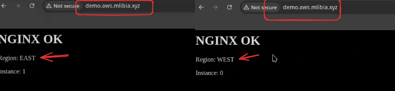

### Flujo paso a paso:

   * ELB distribuye el tráfico entre varias instancias de una aplicación.
   * Se configuran los **Health Checks** para que ELB monitoree el estado de las instancias.
   * AWS FIS experimento cuando haya detenido algunas instancias, **ELB activa automáticamente el Failover Routing**.
   * Si una instancia no pasa el Health Check, ELB deja de enviarle tráfico y lo redirige a otra region.

