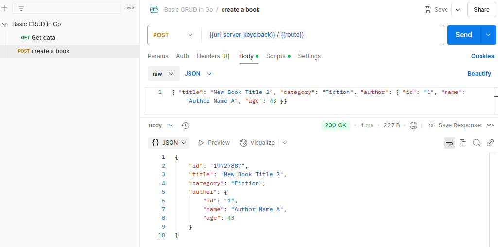
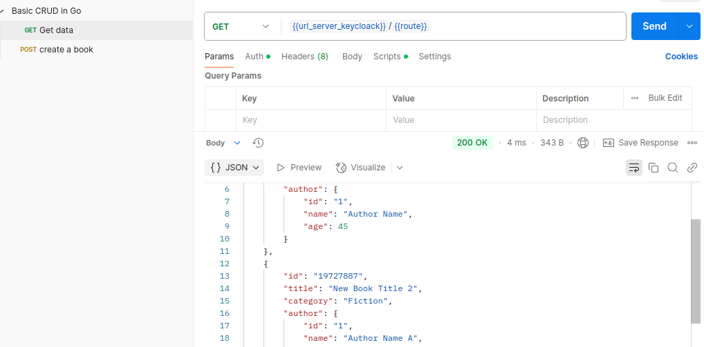

## Pseudocode

### Update

- Set JSON content type
- set in a Params
- Loop over the books, range.
- find by id 
- Delete the movie with the i.d.
- add a new movie in the book list

### Get 

- Set JSON content type
- fill the array 

### Delete

- Set JSON content type
- set in a Params
- Loop over the books, range.
- find by id 
- delete the id 

### Get a book

- Set JSON content type
- set in a Params
- Loop over the books, range.
- find by id 
- set in JSON format

