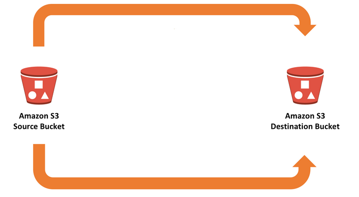

# AWS S3 Bucket Replication with Terraform



This Terraform configuration sets up cross-region S3 bucket replication between two buckets. The configuration includes necessary IAM roles and replication rules.

video: [AWS S3 Bucket Replication with Terraform](https://youtu.be/Qat0sytI6Bc)

## Prerequisites

- AWS CLI configured with appropriate credentials
- Terraform installed (version >= 0.12)
- AWS account with necessary permissions

## Resources Created

- Source S3 bucket
- Destination S3 bucket
- IAM role for replication
- S3 bucket policies
- Replication configuration

## Usage

1. Clone this repository:
```bash
git clone <repository-url>
cd s3replication
```

2. Initialize Terraform:
```bash
terraform init
```

3. Review the configuration:
```bash
terraform plan
```

4. Apply the configuration:
```bash
terraform apply
```

## Configuration Structure

```
s3replication/
├── main.tf         # Main Terraform configuration
└── README.md       # This file
```

## Variables

| Name | Description | Type | Default |
|------|-------------|------|---------|
| `source_bucket_name` | Name of the source bucket | `string` | - |
| `destination_bucket_name` | Name of the destination bucket | `string` | - |
| `destination_region` | AWS region for destination bucket | `string` | - |

## Example

```hcl
module "s3_replication" {
  source = "./s3replication"

  source_bucket_name      = "my-source-bucket"
  destination_bucket_name = "my-destination-bucket"
  destination_region     = "us-west-2"
}
```

## Features

- Cross-region replication
- Versioning enabled on both buckets
- Automatic replication of new objects
- IAM roles and policies for secure replication
- Optional encryption configuration

## Important Notes

1. Both source and destination buckets must have versioning enabled
2. Appropriate IAM permissions are required
3. Existing objects in the source bucket are not automatically replicated
4. Additional costs may apply for cross-region data transfer

## Cleanup

To destroy the created resources:

```bash
terraform destroy
```

## Contributing

1. Fork the repository
2. Create a feature branch
3. Commit your changes
4. Push to the branch
5. Create a Pull Request

## License

This project is licensed under the MIT License - see the LICENSE file for details.


# sources:

[Managing delete marker replication in Amazon S3](https://aws.amazon.com/blogs/storage/managing-delete-marker-replication-in-amazon-s3/)